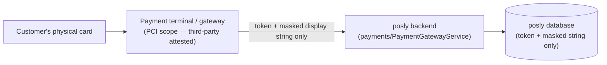

# Security & Compliance — posly

## Scope

Covers Ticket 38's three deliverables: the PCI DSS boundary, secrets management and rotation, and
a penetration-testing plan. Written in the same spirit as `DR_RUNBOOK.md` — real architecture and
real disclosed limitations, not fabricated attestations for infrastructure this deployment doesn't
have.

## 1. PCI DSS boundary

### Where cardholder data actually flows

**No PAN, CVV, expiry date, or track data is ever received, stored, processed, or transmitted by
this backend.** This was verified by a full source survey, not assumed:

- `payments/PaymentGateway.kt` — the `PaymentGateway` interface (`createPayment`, `refund`) takes
  only `orderId`, `amount`, `currency`, and returns only an opaque terminal transaction id. No
  method signature anywhere in this codebase accepts a card number, CVV, or expiry.
- `payments/PaymentModels.kt` — `GatewayPayment.maskedCardNumber` is a **fabricated display
  string** (`"•••• •••• •••• ${(1000..9999).random()}"`), not derived from any real PAN. There is
  no `cardNumber`, `cvv`, `pan`, or `token`-that-represents-a-real-card field anywhere in the
  payment/refund request, domain, or response types.
- `security/PciScopeGuardTest.kt` (added by this ticket) enforces this automatically: it
  reflectively scans every payment/refund request, domain, and response class for forbidden
  field names (`cvv`, `cvc`, `track1`/`track2`, a raw `cardNumber`/`pan`) and fails the build if
  anyone ever adds one. This is a real, executable guardrail — not just this document's claim.

### Scope minimization statement

Because cardholder data never enters this system, the PCI scope for a deployment of posly is
limited to the payment terminal/gateway integration itself — the POS backend, database, and admin
surfaces described in this repository are consistent with staying **out of PAN scope** entirely.

This is an architectural observation, not a compliance certification: **formal SAQ eligibility
(e.g. SAQ A vs. SAQ A-EP) and PCI attestation still require review by a qualified QSA/ASV**, per
the ticket's own "third-party attestations" dependency. This document describes what the code does
today; it does not substitute for that review.

## 2. Secrets management

### Architecture

`secrets/SecretsManager.kt` defines the abstraction; `secrets/InMemorySecretsManager.kt` is the
implementation used today. This follows the same pattern as this codebase's other
externally-backed interfaces (`PaymentGateway`/`EmailGateway`): a real interface with a working
implementation, and a documented seam for a production-grade backend to replace it.

**No real HashiCorp Vault or cloud KMS is integrated in this environment** — none was available to
configure or test against. `InMemorySecretsManager` holds secret material and rotation history only
for the lifetime of the running process: **restarting the app resets every managed secret back to
its `application.conf`/environment-variable-seeded value.** A production deployment should
implement `SecretsManager` against a real secrets store (Vault, AWS/GCP KMS, etc.) so rotation
state survives restarts and secret material is encrypted at rest by that store, not held in
application memory.

### What's rotatable today

Two secrets have genuine "many verifiers must keep working through rotation" semantics and are
managed through this abstraction:

| Secret | Used for | Env override |
|---|---|---|
| JWT signing key (`SecretName.JWT_SIGNING_KEY`) | Signs/verifies every access, refresh, MFA, and invite token (`auth/JwtService.kt`) | `JWT_SECRET` |
| Payment webhook secret (`SecretName.PAYMENT_WEBHOOK_SECRET`) | Verifies the HMAC-SHA256 signature on inbound payment-gateway webhooks (`payments/PaymentGatewayService.kt`) | `PAYMENT_WEBHOOK_SECRET` |

### Zero-downtime rotation

`POST /ops/secrets/{name}/rotate` (ADMIN-only; `name` is `jwt-signing-key` or
`payment-webhook-secret`) generates a new cryptographically random value and makes it current
immediately, while the **superseded version stays valid for verification** until a configurable
grace period elapses (`secrets.rotationGracePeriodMs`, default 24h; `SECRET_ROTATION_GRACE_PERIOD_MS`
env override). Concretely:

- **JWT signing key**: every token now carries a `kid` (key id) claim. `JwtService` resolves the
  correct historical key by `kid` when verifying, and Ktor's `jwt("jwt-auth")` authentication
  provider uses the same per-request resolution (`Application.kt`'s `verifier { authHeader -> ... }`
  block) — so an access token issued moments before a rotation keeps authenticating requests for
  the rest of its grace period, with zero downtime and no forced re-login.
- **Payment webhook secret**: `PaymentGatewayService.verifySignature` accepts a signature made with
  *any* currently-valid version (current, or a previous one still in its grace period) — so a
  webhook already in flight from the gateway when a rotation happens still verifies.

`GET /ops/secrets` (ADMIN-only) lists each managed secret's current version and rotation history —
**metadata only** (id, issued-at, grace expiry, status); no raw secret value is ever returned by
this endpoint. The new value is returned exactly once, in the response to the `rotate` call itself,
the same way a real secrets manager typically shows a freshly generated value only at creation
time. Every rotation is audit-logged (`AuditEvent.SECRET_ROTATED`) without the raw value.

### Known gaps (existing secrets outside this ticket's rotation scope)

- **Per-user MFA TOTP secrets** (`auth/MfaService.kt`, stored in the `users.mfa_secret` column) are
  stored in plaintext at rest with no rotation schedule. They are per-user (not shared/rotated on a
  schedule the way the two secrets above are) — a real deployment should apply column-level
  encryption here. Not addressed in this ticket, per the chosen rotation scope.
- **Per-device client secrets** (`devices/DeviceRegistryService.kt`) are already generated fresh per
  device via `SecureRandom` and held only in memory; "rotation" for a device is effectively
  deprovision-and-re-pair, which the system already supports. No change needed here.

## 3. Penetration testing plan

**No penetration test or exploitation tooling was run against this system as part of this ticket.**
This section is a plan and schedule only, per the ticket's own DoD ("pen-testing plan") and
suggested test ("penetration test scheduling") — not a completed test.

- **Scope**: the deployed posly backend (all authenticated routes, the RBAC layer, the JWT
  auth/rotation flow, the payment-webhook verification endpoint) and its admin surfaces
  (`/ops/*`). Out of scope: the third-party payment terminal/gateway itself, which falls under its
  own PCI attestation.
- **Methodology**: black-box testing of unauthenticated endpoints, plus authenticated
  role-escalation testing exercising the existing `withRole`/RBAC boundaries (e.g. attempting
  cashier access to ADMIN-only `/ops/*` routes, attempting to forge or replay a JWT across a
  rotation boundary), broadly aligned with OWASP ASVS. Recommended tooling categories: authenticated
  API fuzzing, JWT-specific tooling (alg-confusion, key-injection attempts), and standard web
  vulnerability scanning (OWASP Top 10).
- **Cadence**: annually, and after any material change to authentication, payment handling, or
  RBAC — consistent with typical PCI DSS requirement 11 expectations for periodic testing.
- **Responsible party**: an external, licensed penetration-testing vendor — not self-performed,
  consistent with this document's principle of not self-issuing attestations this system requires
  a third party for.
- **Scheduling table** (to be filled in once a vendor and date are engaged):

| Planned window | Scope version (commit/tag) | Vendor | Status |
|---|---|---|---|
| _not yet scheduled_ | | | Pending engagement |

## 4. Known limitations (explicitly disclosed, not fabricated)

- No real Vault/KMS integration — `InMemorySecretsManager` is a working, real abstraction, but its
  state lives only for the process's lifetime, unlike a production secrets store.
- MFA TOTP secrets are stored in plaintext at rest with no rotation schedule.
- No penetration test has actually been performed — only a plan and schedule exist.
- Formal PCI SAQ eligibility has not been determined by a QSA/ASV — this document only describes
  the system's architecture.
